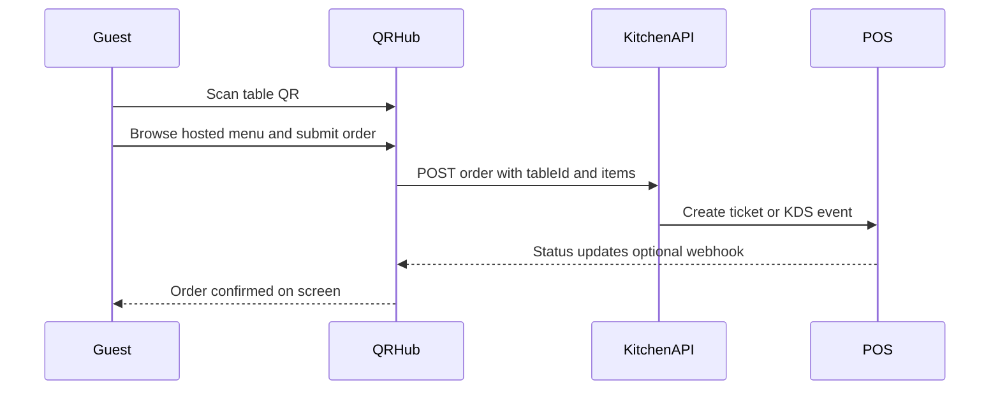

# QR Hub

A simple SaaS web app for restaurants that consolidates reviews, social links, payments, and reservations into one mobile-first landing page — accessible via a single QR code.

**Menu handling depends on your plan:** on **Free**, the menu is an outbound link to the owner's website or a cloud-hosted PDF (e.g. Google Drive, Dropbox). On **Pro**, restaurants can optionally publish a **hosted in-app photo menu** with categories, allergen filters, and prices.

## Features

- **Restaurant setup** — Create a profile in minutes (no login required)
- **Public landing page** — Clean, mobile-first page with large touch buttons
- **QR code generator** — Unique URL per restaurant with downloadable QR
- **Admin dashboard** — Edit links anytime via a secret token URL
- **Tiered plans (Free / Pro)** — See [Plans: Free vs Pro](#plans-free-vs-pro) for what each plan includes
- **10 languages** — English (default), Spanish, Thai, Chinese, Japanese, Indonesian, Malay, Hindi, Arabic, Korean

## Tech Stack

- Next.js 16 (App Router) + TypeScript + Tailwind CSS
- Supabase (Postgres)
- next-intl for internationalization
- Netlify for deployment

## Quick Start (Local)

### 1. Install dependencies

```bash
npm install
```

### 2. Set up Supabase

1. Create a free project at [supabase.com](https://supabase.com)
2. Run the migration in `supabase/migrations/001_restaurants.sql` via the SQL Editor
3. Copy your project URL and API keys from **Settings → API**

### 3. Configure environment variables

Copy `.env.example` to `.env.local`:

```bash
cp .env.example .env.local
```

Fill in:

| Variable | Description |
|----------|-------------|
| `NEXT_PUBLIC_APP_URL` | App URL (`http://localhost:3000` locally) |
| `NEXT_PUBLIC_SUPABASE_URL` | Supabase project URL |
| `NEXT_PUBLIC_SUPABASE_ANON_KEY` | Supabase anon/public key |
| `SUPABASE_SERVICE_ROLE_KEY` | Supabase service role key (server-only) |

### 4. Run locally

```bash
npm run dev
```

Open [http://localhost:3000](http://localhost:3000)

## Deploy to Netlify

1. Push this repo to GitHub
2. Import the site in [Netlify](https://app.netlify.com)
3. Build settings are configured in `netlify.toml`
4. Add the same environment variables in **Site settings → Environment variables**
5. Set `NEXT_PUBLIC_APP_URL` to your Netlify URL (e.g. `https://your-site.netlify.app`)

## Usage Flow

1. Go to `/en/new` and fill in restaurant details + links (up to 6 on Free)
2. After creation, you're redirected to `/dashboard/{id}?token=...` — **bookmark this URL**
3. **Free:** paste a menu URL (your website or a PDF on Google Drive, Dropbox, etc.) — guests leave the hub to view the menu
4. **Pro:** enable the hosted photo menu in dashboard settings and configure per-table QR codes
5. Download the QR code from the dashboard
6. Customers scan the QR → `/r/{id}` landing page with all your links

## Project Structure

```
app/
  [locale]/           # i18n routes (home, new, r/[id], dashboard/[id])
  api/restaurants/    # REST API (create, read, update)
components/           # UI components
lib/                  # Supabase, validators, QR, tiers
messages/             # Translation files (10 locales)
supabase/migrations/  # Database schema
```

## Plans: Free vs Pro

Feature flags are defined in [`lib/tiers.ts`](lib/tiers.ts). Full tier enforcement in production is still evolving; the live demo previews both plans via `?tier=free` or `?tier=pro` on `/r/demo` and `/demo/dashboard`.

| Area | Free | Pro |
|------|------|-----|
| Menu | External link only (website or cloud PDF) — **no in-app menu** | Hosted in-app photo menu with categories, allergens, prices |
| Links | Up to 6 | Unlimited |
| Table QR | No | Per-table QR codes |
| Table ordering | No | Order from table flow (see below) |
| Reservations, daily special, analytics, custom domain | No | Yes |

No payment or subscription logic is included in the MVP.

### Menu (Free vs Pro)

**Free — external link only**

Free restaurants configure the **Menu** link in the dashboard to point to:

- their own website menu page, or
- a PDF hosted on a cloud service (Google Drive, Dropbox, etc.).

Guests tap **Menu** and leave the QR Hub landing page. QR Hub does **not** host or render the menu on Free.

**Pro — hosted in-app menu**

Pro restaurants may publish a **hosted menu** inside the app instead of (or in addition to) an external link. Owners seed a menu template from dashboard settings (`hostedMenu` in [`components/dashboard/RestaurantSettingsForm.tsx`](components/dashboard/RestaurantSettingsForm.tsx)); guests browse categories and dishes at `/r/{id}/menu`. This path is used when `hostedMenu` is configured — see [`components/LandingPage.tsx`](components/LandingPage.tsx).

### Table ordering (Pro)

**Today (MVP / demo)**

- Pro table QR (`/r/{id}/table/{tableId}`) uses WhatsApp handoff via [`lib/table-service.ts`](lib/table-service.ts) — the guest picks order, call waiter, or request bill; the message includes the table number.
- The demo table flow (`/r/demo/table/12`) shows POS/API integration copy from [`components/TableServicePage.tsx`](components/TableServicePage.tsx).

**Roadmap (not yet implemented)**

The Pro vision is end-to-end ordering from the table QR without leaving the app:

1. Guest scans **table QR → browses hosted menu → builds a cart → submits the order**.
2. Orders reach the restaurant's stack through:
   - **REST API** — e.g. `POST /api/orders` with `tableId`, line items, notes, and locale
   - **Webhooks** — notify kitchen display, POS, or middleware on new orders and reservation events
   - **POS connectors** — Square, Toast, Lightspeed, etc. (menu sync + ticket push)

**Value for restaurants:** fewer manual WhatsApp errors, table-attributed orders, analytics on what sells per table and shift, faster kitchen handoff, and an upsell path to custom integrations.



## License

Private
